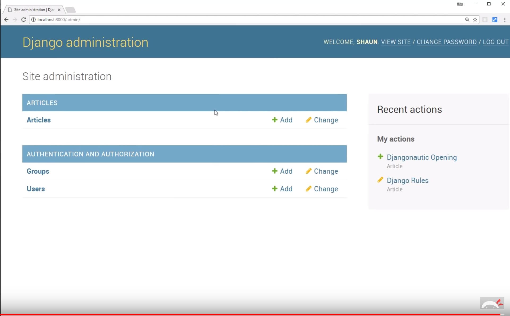

## What is Django?

Python web app framework. Helps with user auth, templating, routing... It provides a good ORM to deal with database queries.

Allows to easily creates dynamic web apps with Python.

## Install Django and prepare the project

`pip install django`, then create and go to the project's directory.

`django-admin startproject <PROJECT_NAME>`

####The general structure of a Django project is made of apps which each have their own urls.py, views.py and templates folder. Each app controls a portion of the project.

## URLs

As usual, browser makes a request, `urls.py` looks at it and fires the adequate function in `views.py`, which sends the response through `HttpResponse` or `render(request, 'my-page.html'`. The `render()` is imported from `django.shortcuts`.

The HTML templates are in the templates folder, and pointed to via the `settings.py` file.

## Apps

Django works in a modular way with apps. Each app takes charge of and controls a part of the project. Add an app with `python manage.py startapp <APP_NAME>` in the console opened in the main project folder. The first child folder in the project folder, which has the same name, is already a django app and serves also as the central hub for the different apps composing the project.

To be validly invoked, each app needs to be registered in INSTALLED APP object in `<PROJECT_NAME>/<PROJECT_NAME>/settings.py`. The main app file `url.py` gets a new line as include points to the new app `urls.py` file.

## Models and django's ORM

**Model creation:** In the new app articles, the `models.py` files holds the models(s) for this app. Each one is a class representing a DB table, each property of that class is a field. As with Sequelize, the properties describe the field content and can have options. Check Doc for field list. They are all properties of the `models` module in `django.db`.

**Model migration:** Once a model is created or modified, it needs to be migrated to the DB. 2 steps: `python manage.py makemigrations` ==> creates an indexed file for the migration, then `python manage.py migrate` to migrate.

**ORM:** In the console, start with `python manage.py shell`. Some DB items can be created directly like so:

```python
patrick@SB-2:~/.../djangonautic$ python manage.py shell
...
>>> from articles.models import Article
>>> article2 = Article()
>>> article2.title = "Django Rules"
>>> article2.save()
>>> Article.objects.all()
<QuerySet [<Article: Hello, World!>, <Article: Django Rules>]>
```

Model methods can also be created inside the model definition.

## Django admin

Allows for site and user access control, DB items interaction.

Start with creating a super user `python manage.py createsuperuser` then run the server in a browser to access this section via `localhost:8000/admin/`, username and password. The `admin` url is already defined in the main app `admin.py` file.

To see the created fields, regiser them in the app `admin.py` file, like so:

```python
from django.contrib import admin
from .models import Article

# Register your models here.
admin.site.register(Article)
```



## Static files

Can be served by django, though would be served from cloud (AWS, Azure...) in production.

In the main app `urls.py` add the `staticfiles_urlpatterns()` module. In the main app, create the folder `assets`, then go to `settings.py` and point to the static files directory.

3rd step is to create or copy the file(s) into this `assets` folder. Pass them to the template hard-coded or dynamically, the latter is better.

Dynamically calling the static files (images, CSS stylesheets...) is done with the `static` module loaded in template tags in the template, then link the stylesheet to the file in `assets` folder.

## Extending templates

Nice feature to keep our HTML templates code DRY. With `` and ``, the common part of the HTML code can be stored in one file, the unique part in another.

Check django doc for other template tags and filters.

## Naming URLs

Allows for using the same variable names in different django apps.

## User creation and login

A lot of of the functionnalities for user creation and logging are already available from django.

lesson 21
